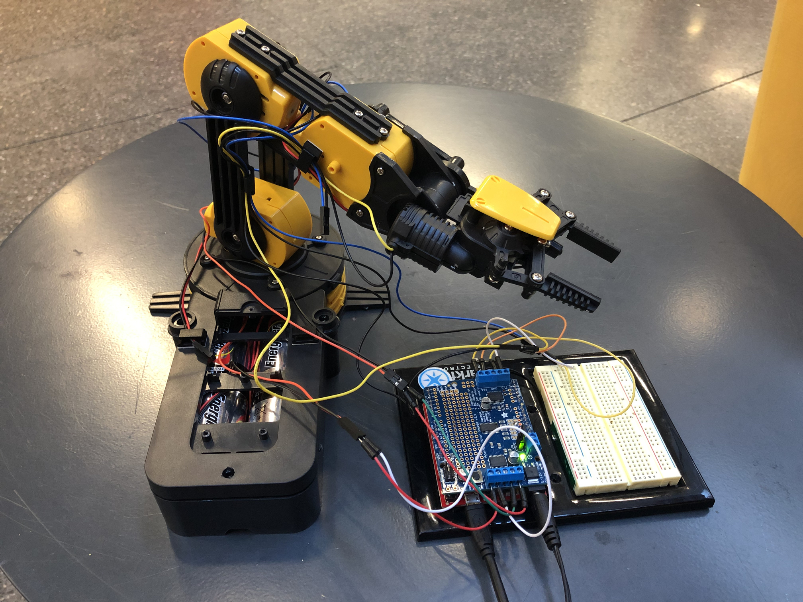

# Rocket.Build Hackathon - Robot Arm Project

For this Hackathon we created an IoT robotic arm that can be controlled wirelessly or via USB. The are can be controlled to move and lift objects. I built the arm using a kit and added functionality using a Particle IoT development board.

## Team Members

[Nathan Robinson](https://nrobinson.me) - Assembled the hardware, developed the software for the robot arm controller, and created an API to allow the arm to be controlled wirelessly.

J Tarness - Developed a frontend application to wirelessly communicate with the robot arm. Designed and pitched the project presentation.

## Applications

* Hardware (arm with Particle board attached)
* Scripting Application (Using Bash scripts to relay list of instructions)
* JavaFx Application (Using Logitech Controller or Keyboard)
* Web Application (Using HTML buttons)

## Hardware Used

* [Robot Arm Kit](https://www.amazon.com/gp/product/B008MONL8O)

* [Adafruit Motor Shield](https://www.adafruit.com/product/1438)

* [Sparkfun Photon RedBoard](https://www.sparkfun.com/products/13321)

* [Logitech Dual Action Controller](https://support.logitech.com/en_us/product/dual-action-gamepad)

## Technologies Used

* [Particle](https://www.particle.io/)

* Java / JavaFx

* JavaScript / HTML / CSS

## Libraries Used

### Particle C++

* [Adafruit_MotorShield](https://github.com/Hypnopompia/Spark-Adafruit_MotorShield_V2)

### Java

* [Jamepad](https://github.com/williamahartman/Jamepad)

## Trello Board (Task Management)

[https://trello.com/b/WkxwAjBQ/robot-arm-project](https://trello.com/b/WkxwAjBQ/robot-arm-project)
## Travis CI (Continuous Integration Testing)

[https://travis-ci.org/nrobinson2000/robot-arm](https://travis-ci.org/nrobinson2000/robot-arm)
## License

Copyright (c) Nathan Robinson. All rights reserved.

Licensed under the [MIT License.](LICENSE)