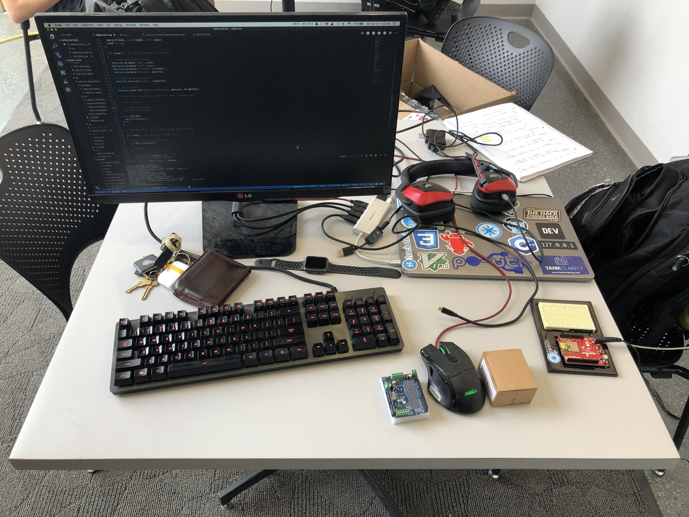
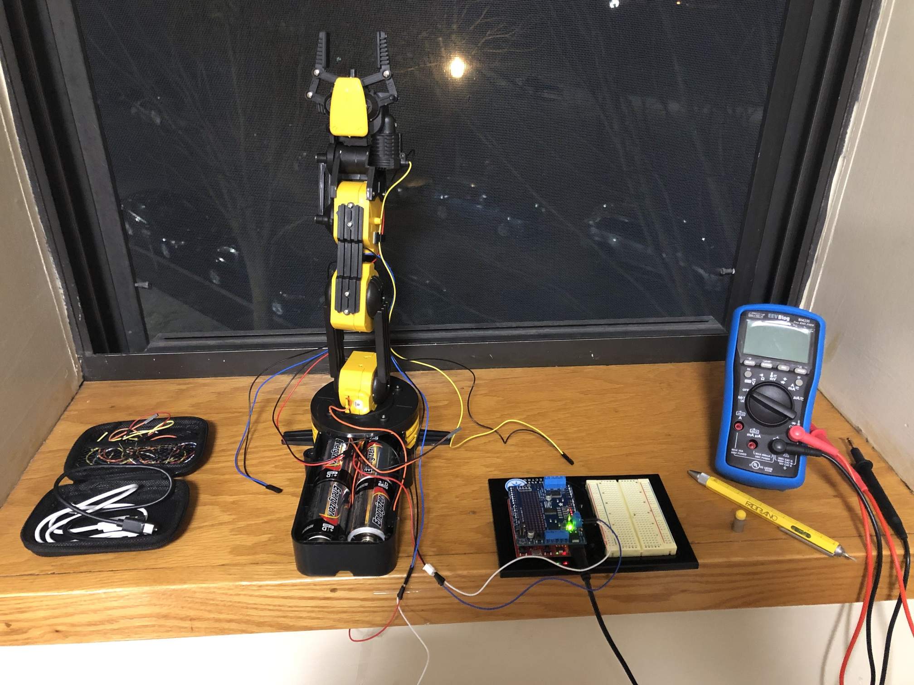

# Rocket.Build Hackathon - Robot Arm Project

## Description of the project

For this Hackathon I was inspired to create a robotic arm that can be controlled over a USB cable or wirelessly over the internet. I wanted to create the arm using a kit I had bought from Amazon, a Sparkfun Photon Redboard, and an Adafruit Motor Shield.

The goal of the project was to build the arm and create an application that would allow users to send the arm input obtained from a Logitech gamepad.

I successfully assembled the arm and added functionality by wiring it to the Redboard and the Motor Shield. Due to the time constraints of the hackathon, I was unable to complete the application element of the project. The arm is functional, as it can receive commands to move the individual motors, but the commands have to be sent manually because I have not implemented gamepad support yet.

I plan to continue this project. I will work on adding support for controlling the arm through the gamepad and create an intuitive graphical interface for monitoring the status of the arm. Once I have completed the project I will create a video documenting the process.

## Challenges I ran into

There were a few challenges I ran into while creating the project.

One of the challenges was that although there was a "Hardware Station" at the hackathon, there was no soldering equipment or screwdrivers available. This was a significant setback because it meant that I could not finish assembling the hardware component of the project, and therefore could not test if the software was working. To solve this problem I had to take a Lyft to Micro Center during the hackathon so I could buy a soldering kit. I completed the assembly of the arm later that night.

A second challenge was that neither my partner or I had enough time to implement the application in Java. I had done similar applications before in JavaScript, which gathered input and sent a payload to a Particle device, but I hadn't used Java to obtain input from a gamepad and send a payload through a REST API yet.

## Accomplishments I'm proud of

I'm proud of building the robot arm and developing the firmware to control it. I would have liked to complete more of the project, but I enjoyed the hackathon nonetheless. I learned more about robotics and leading a project.

## Future Applications

* Scripting Application (Using Bash scripts to relay list of instructions)
* JavaFx Application (Using Java and Logitech Controller or Keyboard)
* Web Application (Using Javascript/HTML/CSS)

## Team Members

[Nathan Robinson](https://nrobinson.me) (Project Lead) - Assembled the hardware, developed the software for the robot arm controller, and created an API to allow the arm to be controlled wirelessly. Will create the frontend graphical user interface to allow the arm to be controlled wirelessly using a gamepad.

J Tarness (Marketing) - Planned the presentation for the project and provided examples of applications for the robot arm.

## Hardware Used

* [Robot Arm Kit](https://www.amazon.com/gp/product/B008MONL8O)

* [Adafruit Motor Shield](https://www.adafruit.com/product/1438)

* [Sparkfun Photon RedBoard](https://www.sparkfun.com/products/13321)

* [Logitech Dual Action Controller](https://support.logitech.com/en_us/product/dual-action-gamepad)

## Technologies Used

* [Particle](https://www.particle.io/)

* Java / JavaFx

* JavaScript / HTML / CSS

## Libraries Used

### Particle C++

* [Adafruit_MotorShield](https://github.com/Hypnopompia/Spark-Adafruit_MotorShield_V2)

### Java

* [Jamepad](https://github.com/williamahartman/Jamepad)

## Trello Board (Project Management)

[https://trello.com/b/WkxwAjBQ/robot-arm-project](https://trello.com/b/WkxwAjBQ/robot-arm-project)

## Travis CI (Continuous Integration Testing)

[https://travis-ci.org/nrobinson2000/robot-arm](https://travis-ci.org/nrobinson2000/robot-arm)

## License

Copyright (c) Nathan Robinson. All rights reserved.

Licensed under the [MIT License.](LICENSE)
